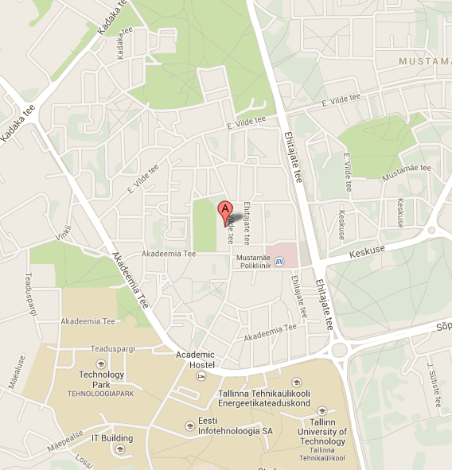

.. title: Accommodation
.. author: Lauri Võsandi <lauri.vosandi@gmail.com>
.. flags: hidden
.. date: 2013-07-15

Vilde tee 121B apartment is located in Mustamäe district of Tallinn, about
`7km from Old Town <https://maps.google.com/maps?saddr=Viru+Keskus+AS,+Viru+6,+Tallinn,+Eesti&daddr=E.+Vilde+tee+121b,+Mustam%C3%A4e,+Tallinn,+Tallinna+linn,+Eesti+Vabariik&hl=et&ie=UTF8&ll=59.418798,24.709625&spn=0.060086,0.198097&sll=59.421505,24.711857&sspn=0.060081,0.198097&geocode=FYztigMdh7x5ASFuGN6voiP9dCn7435mYJOSRjFuGN6voiP9dA%3BFd1iigMdNmB4ASnzXh1rq5WSRjFcXLF56_7qIw&oq=Viru+kesk&t=h&dirflg=w&mra=ls&z=13>`_.

Rooms
-----

The 60m² apartment space distribution is approximately following:

* Livingroom 16m² 
* Bedroom 8m² **available** from 1st of October for 150€ per month, all expenses included
* Bedroom 9² occupied by an Estonian-born Tallinn University of Technology
  Master degree student and software developer
* Bedroom 10m² occupied by an Estonian-born TTK University of Applied Sciences
  mechanics engineering student who's into cars
* Kitchen 5m²

The co-tenants are friendly and helpful

Places nearby
-------------

Universities:

* `Tallinn University of Technology <https://maps.google.com/maps?saddr=E.+Vilde+tee+121b,+Mustam%C3%A4e,+Tallinn,+Tallinna+linn,+Eesti+Vabariik&daddr=Ehitajate+tee+41&hl=et&ie=UTF8&ll=59.401313,24.667568&spn=0.001879,0.006191&sll=59.401113,24.66782&sspn=0.001879,0.006191&geocode=Fd1iigMdNmB4ASnzXh1rq5WSRjFcXLF56_7qIw%3BFSVmigMdoml4ASn5i_Qxq5WSRjEXYoJ6DdSodQ&t=h&dirflg=w&mra=ltm&z=18>`_ 900m, 10 minutes
* `Estonian IT College <https://maps.google.com/maps?saddr=E.+Vilde+tee+121b,+Mustam%C3%A4e,+Tallinn,+Tallinna+linn,+Eesti+Vabariik&daddr=Raja+4,+Tallinn,+Eesti&hl=et&ie=UTF8&ll=59.398585,24.664779&spn=0.007515,0.024762&sll=59.398384,24.669556&sspn=0.007515,0.024762&geocode=Fd1iigMdNmB4ASnzXh1rq5WSRjFcXLF56_7qIw%3BFYlQigMd_lN4ASljbC5wqZWSRjGRzaqZ86ZBHg&oq=Raja+&t=h&dirflg=w&mra=ls&z=16>`_ 600m, 7 minutes

Grocery shops:

* `Grossi toidupood <https://maps.google.com/maps?saddr=E.+Vilde+tee+121b,+Mustam%C3%A4e,+Tallinn,+Tallinna+linn,+Eesti+Vabariik&daddr=Ehitajate+tee+41&hl=et&ie=UTF8&ll=59.401313,24.667568&spn=0.001879,0.006191&sll=59.401113,24.66782&sspn=0.001879,0.006191&geocode=Fd1iigMdNmB4ASnzXh1rq5WSRjFcXLF56_7qIw%3BFSVmigMdoml4ASn5i_Qxq5WSRjEXYoJ6DdSodQ&t=h&dirflg=w&mra=ltm&z=18>`_ 200m, 2 minutes
* `Tipipood <https://maps.google.com/maps?saddr=E.+Vilde+tee+121b,+Mustam%C3%A4e,+Tallinn,+Tallinna+linn,+Eesti+Vabariik&daddr=Akadeemia+tee+8&hl=et&ie=UTF8&ll=59.400245,24.670808&spn=0.00426,0.024762&sll=59.39776,24.670519&sspn=0.00213,0.012381&geocode=Fd1iigMdNmB4ASnzXh1rq5WSRjFcXLF56_7qIw%3BFcVYigMd8mx4ASkBun9dqpWSRjGh4KtiKefqKg&dirflg=w&mra=ls&t=m&z=16>`_ 450m, 5 minutes

Malls:

* `Akadeemia Konsum and Säästumarket <https://maps.google.com/maps?saddr=E.+Vilde+tee+121b,+Mustam%C3%A4e,+Tallinn,+Tallinna+linn,+Eesti+Vabariik&daddr=Akadeemia+S%C3%A4%C3%A4stumarket&hl=et&ie=UTF8&ll=59.402222,24.660444&spn=0.008519,0.049524&sll=59.400933,24.666152&sspn=0.00852,0.049524&geocode=Fd1iigMdNmB4ASnzXh1rq5WSRjFcXLF56_7qIw%3BFQFwigMdBDF4ASHOSZF1GD__oinZD6S6spWSRjHOSZF1GD__og&dirflg=w&mra=ls&t=m&z=15>`_ 1100m, 13 minutes
* `Kadaka Selver <https://maps.google.com/maps?saddr=E.+Vilde+tee+121b,+Mustam%C3%A4e,+Tallinn,+Tallinna+linn,+Eesti+Vabariik&daddr=kadaka+selver&hl=et&ie=UTF8&sll=59.408884,24.672976&sspn=0.030052,0.099049&geocode=Fd1iigMdNmB4ASnzXh1rq5WSRjFcXLF56_7qIw%3BFY-PigMdd2R4ASGcZVjyE5GzvCkt5iA4UJSSRjGcZVjyE5GzvA&dirflg=w&mra=ltm&t=m&z=15>`_ 1500m, 18 minutes

Feeling hungry?

* `Drumsticks <https://maps.google.com/maps?saddr=E.+Vilde+tee+121b,+Mustam%C3%A4e,+Tallinn,+Tallinna+linn,+Eesti+Vabariik&daddr=Kadaka+tee+177&hl=et&ie=UTF8&sll=59.404722,24.657102&sspn=0.000939,0.003095&geocode=Fd1iigMdNmB4ASnzXh1rq5WSRjFcXLF56_7qIw%3BFW5xigMdJzx4ASn_Yu2sUpSSRjEBQNJA5fIIhw&t=h&dirflg=w&mra=ls&z=16>`_ asian fast food, 11 minutes
* `Männi kohvik <http://mannikohvik.ee/en/kontakt/>`_ for the best `shashlik <http://en.wikipedia.org/wiki/Shashlik>`_ in town, 11 minutes
* `Pagaripoisid <https://maps.google.com/maps?saddr=E.+Vilde+tee+121b,+Mustam%C3%A4e,+Tallinn,+Tallinna+linn,+Eesti+Vabariik&daddr=Ehitajate+tee+29&hl=et&ie=UTF8&ll=59.400988,24.667745&spn=0.001879,0.006191&sll=59.400353,24.667803&sspn=0.001879,0.006191&geocode=Fd1iigMdNmB4ASnzXh1rq5WSRjFcXLF56_7qIw%3BFS1iigMd12t4ASnvhHzfqpWSRjHlK07MZ7nJZw&t=h&dirflg=w&mra=ls&z=18>`_ bakery and cafe, nearest place you can get a Cafe Latte, 2 minutes

Buses 24, 24A and trolleybuses 1, 3 take you to Old Town in about 20 minutes.

Rent
---------
Rent per room is 150€/month which includes:

* Electricity
* Water
* Heating
* Wireless internet connection
* Samsung washing machine
* Gas stove
* Fridge

I am not making any profit off this venture, the total rent barely covers
apartment lease and utilities.

Internet
--------
The apartment is equipped with Elion's 100Mbps downlink and 20Mbps uplink 
internet connection. Internet access is provided by dual-band TP-Link TL-WDR4300
router with OpenWRT software which should do a pretty good job letting you browse
the internet at maximum speeds. Optionally you can hook up *ethernet* cable
and enjoy the benefits of wired connection.
