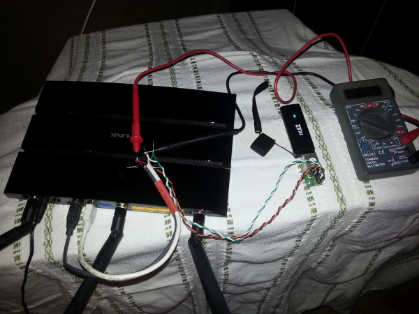

.. title: TP-Link WDR4300 + Huawei E1752 + TELE2 mobiilne internet
.. date: 2013-09-04
.. tags: OpenWrt, TP-Link WDR4300, 3G, TELE2, Huawei, Atheros
.. author: Lauri Võsandi <lauri.vosandi@gmail.com>

TP-Link WDR4300 + Huawei E1752 + TELE2 mobiilne internet
========================================================

Nii mõneski kohas ei levi isegi ADSL, samas on tarvidus internetti lehitseda.
Android telefoni juhtmeta kuumpunkt (*wireless* *hotspot*)
ajab tihtipeale asja ära, samas kui
telefonilevi on ka nõrgavõitu ning peab pööningule ronima, võib osutuda
mõistlikumaks ning püsivamaks alternatiiviks 3G modemi paigaldamine
mõne marsruuteri külge.

Soojenduseks võib lugeda `minu eelmist artiklit samal teemal </search.html#3G>`_ 
kasutades enam mitte nii väga kättesaadavat Asus WL500G Premium marsruuterit.
Nüüdsekd on omajagu aega mööda läinud ning pisut modernsemat võrguriistvara
on liikvel. Käesolev näide tugineb TP-Link WDR4300 marsruuterile.

Alustame OpenWrt püsivara paigaldusest, eeldades et marsruuter
on vähemalt paigaldamise ajal võrgukaabliga internetti ühendatud ning
on ligipääs marsruuteri käsureale:

.. code:: bash

    cd /tmp/
    wget http://downloads.openwrt.org/attitude_adjustment/12.09/ar71xx/generic/openwrt-ar71xx-generic-tl-wdr4300-v1-squashfs-factory.bin
    sysupgrade openwrt-ar71xx-generic-tl-wdr4300-v1-squashfs-factory.bin

Pöidlad pihku ja ootame marurahulikult et uus tarkvara marsruuteri
püsimällu kirjutataks ning masin end taaskäivitaks.
Logime telnet või OpenSSH abil sisse ning paigaldame vajalikud paketid:

.. code:: bash

    opkg update
    opkg install kmod-usb-uhci kmod-usb-serial kmod-usb2 kmod-usb-serial-option comgt usb-modeswitch nano htop usbutils

Peale seda tuleb mudida võrguseadistusti failis */etc/config/network*,
jutt käib siinkohal *WAN* võrguliidesest [#3gdongle]_.

.. code:: bash

    config interface     wan
        option 'ifname' 'ppp0'
        option 'proto' '3g'
        option 'device' '/dev/ttyUSB0'
        #option 'pincode' ''
        #option 'service' 'umts_only' # Vaikimisi automaatne valik; ainult 2G/2.5 jaoks gprs_only; ainult 3G/3.5G jaoks umts_only
        option 'keepalive' '1 3600'
        option 'pppd_options' 'noipdefault' # TELE2 häkk

Nüüd oleks paslik masin taaskäivitada

.. code:: bash

    reboot

Erinevalt vanematest OpenWrt väljalasetest mingit muud keemiat pole vaja teha.
Käesoleva marsruuteri puhul muutus probleemiks voolutarve.
Tüüpilisi USB pordi kasutusujuhte nende marsruuterite juures on kaks:
välise toitega USB kõvaketta ühendamine ning USB printeri ühendamine.
Mõlemal juhul ei tarbita USB pesast palju voolu ning 500mA pesa kohta ei
muutu probleemiks.

Igasuguste anomaaliate puhul soovitan proovida toiteplokiga
USB hubi paigaldamist marsruuteri ja 3G modemi vahele.
Kui probleemid lahenevad on 99% tõenäosusega probleem selles,
et üks USB pesa ei anna välja piisavalt palju ampreid 3G pulgale.
USB standard näeb ette, et 500mA on maksimaalne vool USB pesa kohta.
Sõltuvalt masti kaugusest ja muudest faktoritest võib 
3G modem võtta kuni 800mA voolu eriti just 3G/3.5G režiimis.

Kui USB hubi pole käepärast võtta, võib proovida modemit 
käivitada 2G režiimis. Asi on lihtsalt selles, et modem võtab
3G režiimis rohkem voolu:

.. code:: bash

    option 'serivce' 'gprs_only'

Kui on selge et vool on probleemiks võib peale eelnimetatud häkkide lihtsalt kahe
USB pesa toiteahelad sillata, nii nagu seda tehakse osade väliste kõvaketastega:

.. figure:: http://www.govgroup.com/images_products/2266579_big.jpg

    Et modem ammutaks ampreid kahest pesast sobib säärane kaabel

Kui sellist juhet pole võtta siis peab mõistust kasutama ja olemasolevast
(t)räniorust üles kaevama mõned vanad hiired ning neil sabad tagant lõikama.
Käesolevas katses sain jõudeolekus 100-200mA näite, ühendatuna keskmiselt 300mA näite ning
manti üles laadides kohati 500-600mA ringis näite, nii et julgeks arvata
et pisteliselt käib sealt rohkemgi läbi:

    700mA on 3G modemi jaoks täiesti tavaline vool

Veidi kaubandusliku välimusega lahendus oleks marsruuter lahti kruvida ning
5V rajad lihtsalt traadijupiga kokku joota.

Analoogselt varasemale artiklile, kui ruuterile pole võimalik tarkvara paigalduse ajal Internetti anda
võrgupesale, peab vajalikud failid eelnevalt alla sikutama ning
näiteks *scp* abil kopeerima:

.. code:: bash

    ROOT="http://downloads.openwrt.org/attitude_adjustment/12.09/ar71xx/generic/packages/"
    wget -c $ROOT/usb-modeswitch_1.2.3-2_ar71xx.ipk   
    wget -c $ROOT/usb-modeswitch-data_20120120-1_ar71xx.ipk   
    wget -c $ROOT/kmod-usb-core_3.3.8-1_ar71xx.ipk
    wget -c $ROOT/kmod-usb-serial_3.3.8-1_ar71xx.ipk
    wget -c $ROOT/kmod-usb-serial-option_3.3.8-1_ar71xx.ipk
    wget -c $ROOT/kmod-usb-uhci_3.3.8-1_ar71xx.ipk
    wget -c $ROOT/kmod-usb2_3.3.8-1_ar71xx.ipk
    wget -c $ROOT/comgt_0.32-21_ar71xx.ipk
    wget -c $ROOT/usbutils_005-1_ar71xx.ipk
    wget -c $ROOT/libusb_0.1.12-3_ar71xx.ipk   
    wget -c $ROOT/libusb-1.0_1.0.9-1_ar71xx.ipk 
    wget -c $ROOT/zlib_1.2.7-1_ar71xx.ipk
    wget -c $ROOT/chat_2.4.5-8_ar71xx.ipk 
    wget -c $ROOT/kmod-nls-base_3.3.8-1_ar71xx.ipk 
    wget -c $ROOT/librt_0.9.33.2-1_ar71xx.ipk
    wget -c $ROOT/libpthread_0.9.33.2-1_ar71xx.ipk
    wget -c $ROOT/kmod-usb-serial-wwan_3.3.8-1_ar71xx.ipk

.. [#3gdongle] `Use 3G/UMTS USB dongle for WAN connection <http://wiki.openwrt.org/doc/recipes/3gdongle>`_
