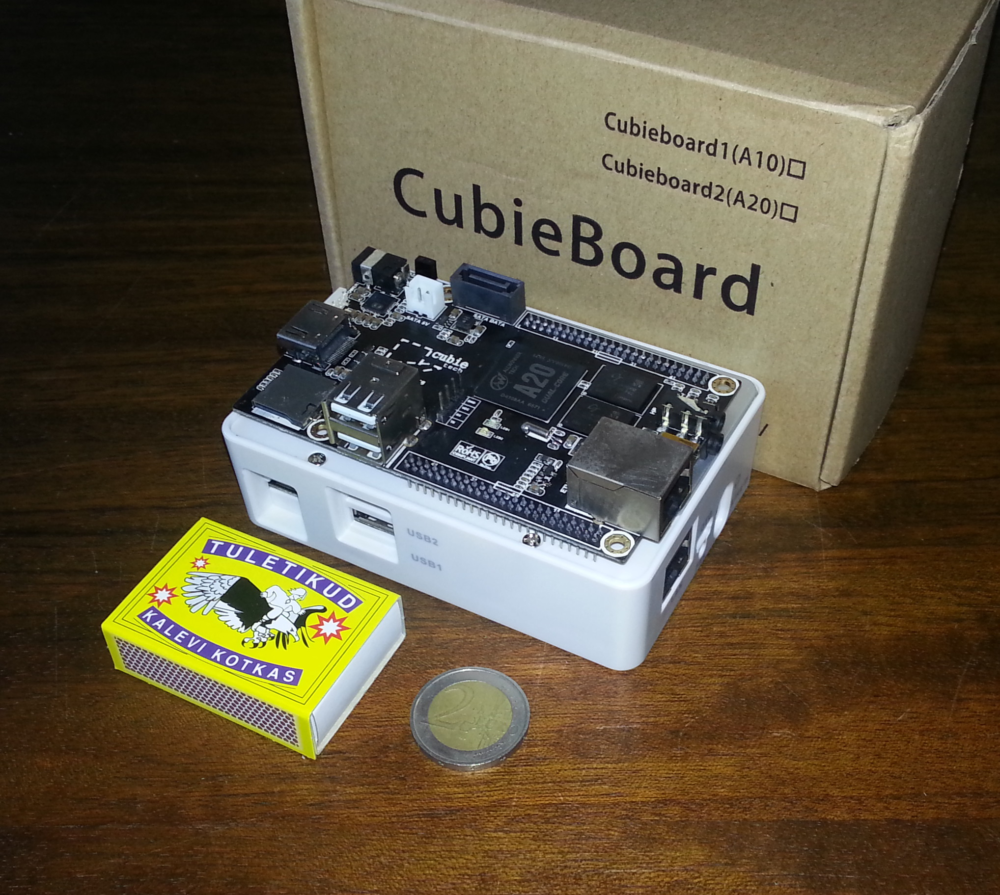

.. author: Lauri Võsandi <lauri.vosandi@gmail.com>
.. date: 2013-11-11
.. tags: Cubieboard, Cubietruck, Allwinner, sunxi, Raspberry Pi, raspi, ARM, Debian

Cubieboard2
===========

Sissejuhatus
------------

Raspberry Pi on nüüd ka lõpuks Eestis kättesaadav ning
omajagu populariseerinud krediitkaardisuuruseid arvuteid.
Raspberry Pi jõudlus aga jätab soovida ning Hiina päritolu
kaubamärgid on tasapisi üle võtmas valdkondi, milles
seni on olnud osalised valdavalt ameeriklased.

Spetsifikatsioon
----------------

Mõnda aega tagasi lasti välja Cubieboard2, mis oma hinna kohta pakub
üllatavalt vinget spetsifikatsiooni [#cubieboard]_:

* Hiina päritolu Allwinner A20 süsteemikiip
* ARM Cortex A7 arhitektuuriga kahetuumaline protsessor
* Mali400 MP2 videokaart
* 1GB DDR3 mälu
* 4GB NAND välkmälu
* 2160p riistvaraline video dekooder
* SATA pesa
* microSD pesa
* HDMI pesa
* 2x USB2.0 pesad
* Infrapunasensor

*Pics* *or* *it* *didn't* *happen*
----------------------------------

Sisemisele mälule on vaikimisi paigaldatud pooletoobine Android.
Kui *microSD* mälukaart on paigaldatud püüab Cubieboard alglaadimist sooritada
väliselt mälukaardilt.

    Kodumaine pilt seadmest:

Debiani paigaldus
-----------------

Cubieez on Debian *armhf* harul baseeruv kettatõmmis mille võib alla laadida
cubieforums lehelt [#cubieforums]_ või minu pilveserverist:

.. code:: bash

    wget -c http://lauri.vosandi.com/shared/Cubieboard2/cubieez_1.0.0_A20.7z
   
Pakime lahti:

.. code:: bash

    7z x cubieez_1.0.0_A20.7z
    
Kirjuta tõmmis vähemalt 2GB suurusele *microSD* mälukaardile:

.. code:: bash

    cat cubieez_1.0.0_A20.img  > /dev/mmcblk0

Pista mälukaart Cubieboard2 sisse ja tee seadmele taaskäivitus.
Kasutajanimi on on *cubie* ning parooliks on *cubieboard*.

Failisüsteemi laiendamine
-------------------------

Tõmmis on disainitud 2GB suuruste mälukaartide jaoks.
Selleks et kasu lõigata partitsioneerimata alast 4GB või suurema mälukaardi puhul
käivita *cubie-config* ning vali menüüst *expand* *filesystem*.

.. code:: bash

    sudo cubie-config
    
Seejärel tee masinale taaskäivitus.

USB WiFi pulga seadistamine
----------------------------

Kui sul peaks mõni USB WiFi pulk vedelema, kopeeri suvalisest Ubuntu
masina */lib/firmware* kataloogist võrgukaardi püsivara ning tee seadmele
taaskäivitus. Viisakam variant on muidugi tuvastada mis võrgukaardiga tegu on
*lsusb* andmetel:

.. code::

    Bus 002 Device 002: ID 148f:5370 Ralink Technology, Corp. RT5370 Wireless Adapter

Seejärel tuvastada mis paketis võrgukaardi püsivara pesitseb ja
ainult see paigaldada:

.. code:: bash

    sudo apt-get install firmware-ralink

Debianis on enamike võrgukaartide tüürelid (*driver*) kaasas,
kuid kinnise lähtekoodiga püsivara (*firmware*) peab ise paigaldama.

Seadista võrguliides failis */etc/network/interfaces*:

.. code::

    auto wlan1
    allow-hotplug wlan1

    iface wlan1 inet static
        address 192.168.4.3
        netmask 255.255.255.0
        gateway 192.168.4.1
        dns-nameservers 192.168.4.1
        wpa-ssid lauri-hackerspace
        wpa-psk salakala
        
Lae võrgu seadistused uuesti:

.. code:: bash

    sudo service networking restart

Veendu et *resolv.conf* sisaldaks õiget nimeserveri aadressi:

.. code:: bash

    echo "nameserver 192.168.4.1" | sudo tee /etc/resolv.conf

fex2bin, bin2fex
----------------
Selleks et seadistada Allwinner A10 või A20 süsteemikiibil baseeruvate seadmete
riistvara tuleb modifitseerida *script.bin* faili mälukaardil asuva
FAT32 failisüsteemi sees.

Tegu ei ole tekstifailiga ning selleks, et sellega inimese kombel ringi
käia tuleb ta kõigepealt viia *bin2fex* programmiga binaarkujult tekstikujule.
Peale selle faili modifitseerimist tuleb see *fex2bin* programmiga jälle
binaarkujule viia.

Teisendamiseks võib kasutada `Miniand <https://www.miniand.com/tools/fexc>`_
võrguteenust. Kui sellega õnne pole siis tuleb paigaldada
*bin2fex* ja *fex2bin* programmid 
[#sunxi-tools]_ tarkvarakogumikust.

USB OTG pesa kasutamine USB host režiimis
-----------------------------------------

Selleks et USB OTG pesa panna tööle USB host režiimis nii et sinna näiteks
hiirt või klaviatuuri vastava üleminekuga külge ühendada, tuleb
eelnimetatud failis üles leida õige *[usbc0]*, *[usbc1]*
või *[usbc2]* sektsioon ning seal lubada *usb_host_init_state* ning keelata
*usb_detect_type*.
Minu Cubieboard2 vastav sektsioon näeb välja järgnev:

.. code:: ini

    [usbc0]
    usb_used = 1
    usb_port_type = 2
    usb_detect_type = 0
    usb_id_gpio = port:PH04<0><1><default><default>
    usb_det_vbus_gpio = "axp_ctrl"
    usb_drv_vbus_gpio = port:PB09<1><0><default><0>
    usb_restrict_gpio = port:PH00<1><0><default><0>
    usb_host_init_state = 1
    usb_restric_flag = 0
    usb_restric_voltage = 3550000
    usb_restric_capacity = 5
    
Ekraani lahutusvõime seadistamine
---------------------------------

Osad Cubieboard2 tüürelid loevad oma seadistused *uEnv.txt* failist
*microSD* mälukaardil olevast FAT32 failisüsteemist.
Lisa *disp.screen0_output_mode=EDID:1920x1080p60* rea *extraargs* lõppu,
selleks et HDMI väljund lülitada FullHD resolutsioonile.
Tähelepanu peaks pöörama sellele, et need argumendid on eraldatud tühikuga,
nii et rida näeb välja umbes-täpselt selline:

.. code::

    extraargs=mac_addr=... console=... earkyprintk=... disp.screen0_output_mode=EDID:1920x1080p60

OpenSSH võtmete uuendamine
--------------------------

Vaikimisi on sisse lülitatud ka OpenSSH server, viisakas oleks selle
võtmed uuesti genereerida:

Esmalt kustuta olemasolevad võtmed:

.. code:: bash

    sudo rm /etc/ssh/ssh_host_*_key*

Loo uued võtmed:

.. code:: bash

    sudo dpkg-reconfigure openssh-server

Soovitatav oleks *root* kasutaja parool kustutada, selleks et *root*
ei saaks sisse logida:

.. code:: bash

    sudo passwd -l root

Ning lähtestada tavakasutaja parool:

.. code:: bash

    sudo passwd cubie

Kust osta saab?
---------------

Cubieboard2 ning selle järeltulija Cubietruck on mõlemad kättesaadavad
r0ckstore veebipoest [#r0ckstore]_ ning paljudelt muudelt tarnijatelt.
Kahe Cubieboard2 plaadi ning ühe korpuse hinnaks tuli tarnimisega koos 115€.
Eestis saab Cubietruck2 plaati tellida hinnaga 78€
ettevõttelt ITT Group [#itt]_.

.. [#cubieboard] http://cubieboard.org/
.. [#r0ckstore] http://store.r0ck.me/
.. [#cubieforums] http://www.cubieforums.com/index.php?topic=442.0
.. [#sunxi-tools] http://linux-sunxi.org/Sunxi-tools
.. [#itt] `ITT Group <http://www.ittgroup.ee/et/e-shop/browse/28?sef=hc>`_ veebipood

