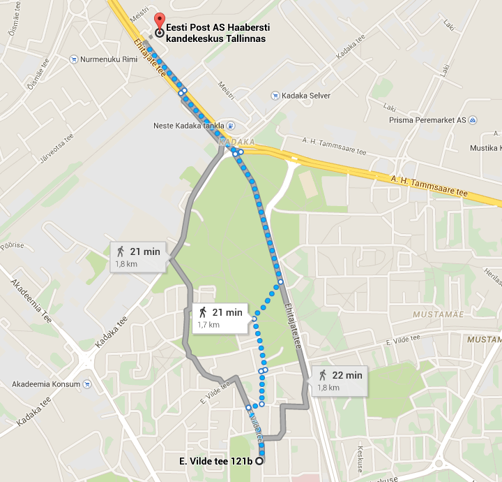
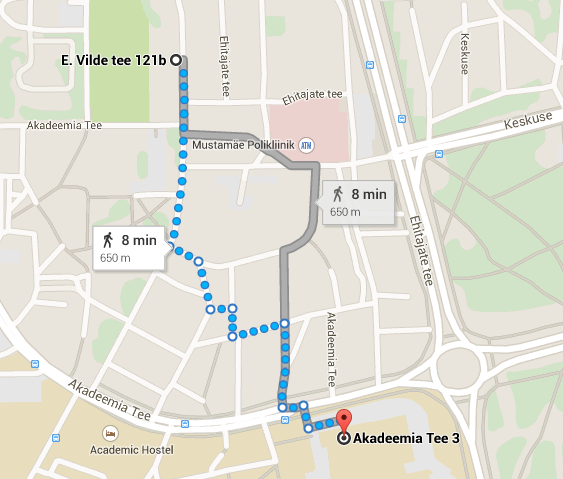
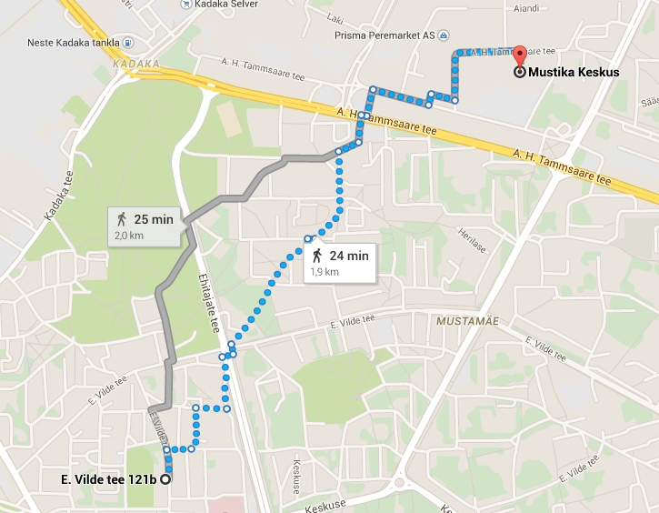

.. tags: rant
.. published: 2014-12-03

Omniva logistika
================

Mu registreeritud elukoht on olnud viimased 6+ aastat Vilde tee 121b korterelamus.
Üpris pikalt ei olnud ligiduses ühtegi postkontorit ning
pakid saadeti Haabersti kandekeskusse.
Ühistranspordiga on võimatu sinna sõita ning jala käimiseks kulub tunnike.

    Haabersti kandekeskus on pea 2km kaugusel

Viimased aasta või kaks on olnud postkontor TTÜ hoones aadressil Akadeemia tee 3.
Asukoht on hea ning igapäevaselt seal kandis liikudes jääb postkontor täpselt tee peale.
Pakid automaatselt Akadeemia tee kontorisse tulema ei hakanud,
minu mäletamist mööda käisin tegemas avaldust, et pakke edaspidi Akadeemia teele saadetaks.
Mõnda aega see süsteem täiesti töötas.

    Akadeemia tee postkontor jääb täpselt tee peale kui linnast tulla
    
Alates 2014 juunist on Eesti Posti uueks nimeks Omniva ja tundub, et neil on uus
äristrateegia.
Viimased kaks pakki on praeguse seisuga saadetud Mustika keskuse kontorisse.
Seal käimiseks kulub mul tunnike, vahet pole kas jala või ühistranspordiga.

    Mustika keskuses käimiseks kulub tunnike

Saatsin neile kirjakese, et mis nüüd juhtunud on ning miks pakke enam
Akadeemia tee kontorisse ei saadeta. Selle peale vastati järgnevalt:

.. code::

    Tere Lauri Võsandi,
    
    Annan teada, et saadetised saabuvad indeksi järgi postkontorisse ning
    püsivat ümbersuunamist teise postkontorisse on võimalik teha ainult
    avalduse alusel, mis on tasuline teenus- kehtib 6 kuud ja maksab 6,40 eurot.
    Avaldust on võimalik vormistada sobivas postkontoris.

Elagu ettevõtlus ja innovatsioon ütlen ma selle peale.
Muide uus Omniva logo näeb välja nagu paks libastuv poisike...
