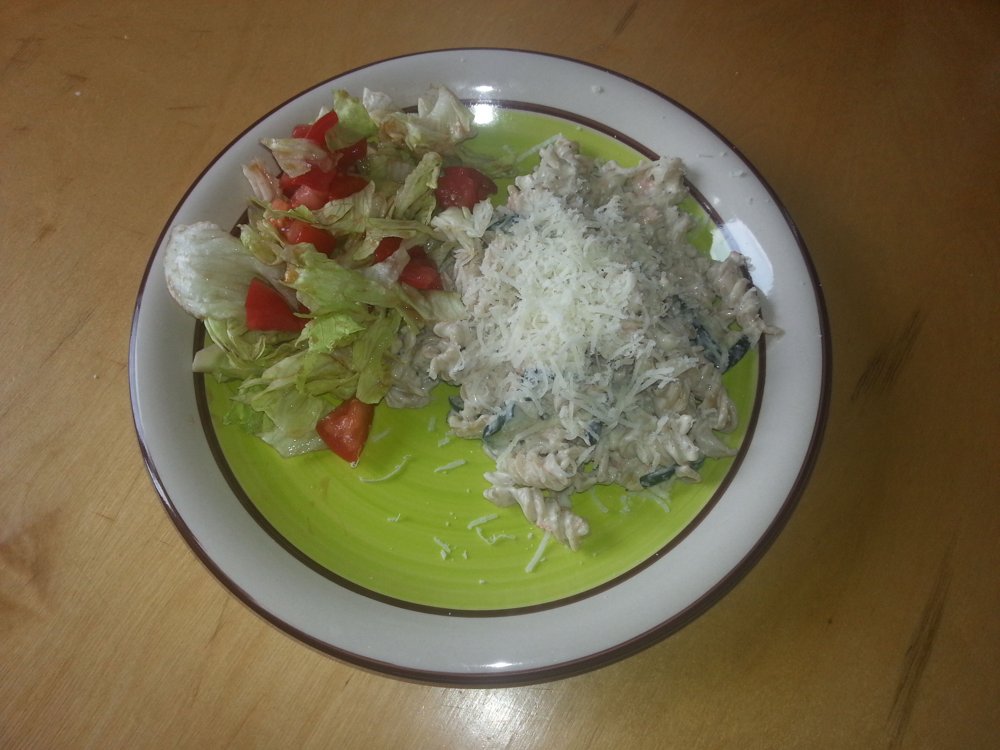

.. title: Lõhepasta
.. author: Lauri Võsandi <lauri.vosandi@gmail.com>
.. tags: cooking
.. flags: hidden
.. date: 2013-10-31

Lõhepasta
=========

Juulikuu on läbi ning turult leiab suvikõrvitsaid!

Üldinfo:

* Kogus 6 portsjonit
* Valmistamise aeg 20-30 minutit

Koostisosad:

* Täisterapasta (500g)
* Üks suvikõrvitsaline
* Külmsuitsulõhet üks-kaks pakki (75-180g)
* Küüslaugu küüsi 3-6tk
* Philadelphia toorjuustu üks-kaks pakki (200-300g)
* Must pipar

Sammud:

* Keeda pasta aeglase tulega
* Pasta keemise ajal lõika suvikõrvits pikkupidi pooleks, eemalda seemnetega südamik
* Viiluta suvikõrvits 2-5mm paksusteks seibideks
* Küpseta suvikõrvitsa viilud võis või õlis kuni seibid on parajalt pruunikad ning mitte väga
  vesised
* Lisa pannile purustatud küüslaugu küüned
* Sega keedetud pasta sisse küpsetatud suvikõrvitsa viilud
* Sega pasta sisse suitsulõhe tükid
* Sega toorjuust ning pisut piima või kohvikoort
* Lisa musta pipart ning soola maise järgi
* Kuumuta veelkord läbi ning sega

Serveerimine:

* Aseta portsjoni jagu pastat taldrikule
* Riivi peale *parmesani* juustu
* Lisa jääsalati, tomati ja kurgi salat

Aseained:

* Päris *parmesani* juust Parmigiano Reggiano on võrdlemisi kallis, asenduseks sobib ka kohalik Forte juust või mõni muu laapjuust
* Suvikõrvits (ing. k. *summer* *squash*) on tegelikult üldnimetus taimede kohta,
  mille vili lõigatakse enne, kui seemned kõvaks küpsevad ning südamik
  pole enam tarbitav.
  *Puhmik-õlikõrvits* on rahvasuus tuntud *suvikõrvitsa* täpsem nimetus, 
  tuntud ka itaaliapärase nimetusega *zucchini*,
  prantsusepärase nimetusega *courgette* ning
  venepärase nimetusega kabatšokk (vene. k. кабачок)

Täiendavad nipid:

* Nagu alati, ära järgi retsepti ja eksperimenteeri ise!
