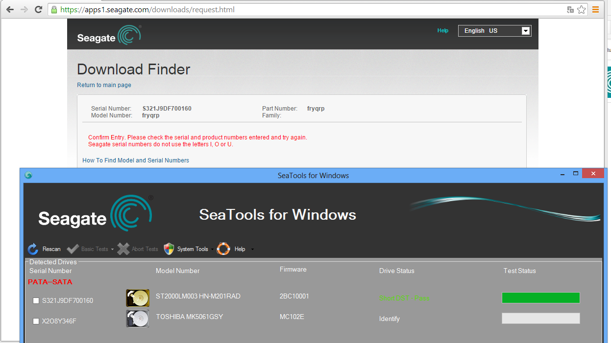
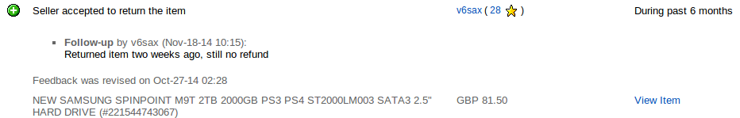

.. published: 2014-12-02
.. tags: rant, scam, Seagate, Samsung, eBay, PayPal, hdparm, systemd, pm-utils

Seagate M9T saga
================

Introduction
------------

In September of 2014 I ordered one of those
fancy new 2TB disks for my laptop.
It was foolish of me to order it from eBay hoping to get marginally lower price of
94 GBP, that's roughly 115€ or 150 USD.
As the `advertisement <http://www.ebay.com/itm/221544743067?_trksid=p2059210.m2749.l2649&ssPageName=STRK%3AMEBIDX%3AIT>`_ 
said it was a brand-new, unused, unopened, undamaged 2.5" internal SATA harddisk, this however was not exactly true.

.. figure:: http://www.storagereview.com/images/StorageReview-Samsung-Spinpoint-M9T.jpg

    Samsung/Seagate Spinpoint M9T

Manufacturer price policy is rather silly so these disks within external 
enclosures are actually cheaper than the ones designed for internal use.
Scammers buy these disks within external enclosures
and resell them as internal disks.

The main problem here is that the manufacturer warranty is void and if you
attempt to send such disk to Seagate customer service they will tell you 
the manufacturer warranty does not cover these disks.
Buyers are of course not aware of this and once the disk fails,
there is nobody to turn to except the seller on eBay.

Naïve firmware
--------------

By default the disk has no power management turned on and it
seems to be doing silly thing in such case.
For instance heads are being parked after 3 seconds of idling
which seems to be a bit excessive.
Western Digital disks also have such "feature" called IntelliPark [#intellipark]_.
I suppose it has something to do with the fact that most USB-SATA bridges
don't pass power management commands and disks intended for such enclosures
should park heads as soon as possible to avoid damage.
I am also going to assume that Windows sets power management for internal disks
so disks aren't going to go nuts.

After about month of using the disk I noticed that the load cycle count
had exceeded 30000. Load cycle count refers to number of times
the harddisk head has been parked in the safe zone and for most modern
disks it's around 600000, so within month I had used up 5% of the designed limit.

Seagate service
---------------

Once the load cycle count issues emerged I first queried Seagate
whether there could be something wrong with the firmware:

.. code::

    Dear Lauri Võsandi: 

    Thank you for contacting Seagate Support. 

    I am sorry that hear that you having problem with
    your the cycle count of your drive.

    Unfortunately since the drive serial number S32WJACF104748
    was taking out of the encloser the warranty was voided. 

    The drive was not meant to be use as a internal drive.
    I suggested you take the drive out of the computer and connect it to 
    a Window PC and test with Seatools.
    http://www.seagate.com/gb/en/support/downloads/item/seatools-dos-master/

    Unfortunately we do not support your version of Linux.

    I apologizes for the inconvenience that may cost you. 
    
So besides being oblivious about unicode on 21st century they also
don't support Linux.
The fact that the disk was taken out of an external enclosure and the warranty was void
came to me sort of a surprise because the seller on eBay didn't mention any of this.

I tried updating the firmware but the SeaTools of course are only available for Windows
and even there the firmware update feature does not work.

    This is how "no firmware updates available" looks like in SeaTools
    
Seagate eventually confirmed that the error was displayed because
there were no firmware updates available for the harddisk.

Returning the disk to seller
----------------------------

When I queried the seller about the lack of manufacturer warranty
he never gave me really proper answer.
He was pointing on the other sellers that they're doing the same
as if that was some sort of excuse.
I had to leave negative comment to get thing going.
He agreed to refund the disk so I sent it back on 30th of October, 2014 to the address he provided:

.. code::

    Richard Ponniah
    21 Bourne Valley Road
    Poole BH121DX
    United Kingdom
    
According to package tracking [#package-tracking]_ he picked up the package on 5th of November, 2014.
Further communications have proven fruitless and so far I haven't got my money back.
The whole eBay and PayPal have been so mechanized it's nearly impossible to get
contact with human customer service.
E-mails sent to PayPal and eBay customer service haven't been responded.
This seller goes by many names and he's also known as Rich Woody.
I have now multiple e-mails provided by him aswell:
richwoody17@googlemail.com and richwoody17@hotmail.com.
His eBay page [#woodystuff]_ has surprisingly positive feedback and I am guessing the buyers
are also clueless about the scam.

    Surprisingly you can change feedback only once.

Note that I can't change `my feedback <http://feedback.ebay.com/ws/eBayISAPI.dll?ViewFeedback2&ftab=FeedbackAsSeller&userid=woodystuff&de=off&interval=0&items=200>`_ to negative anymore nor can I add another follow-up,
this seems to be another interesting "feature" of eBay.
When I click on "Leave Feedback" link on his store page 
eBay is just saying "You have no transactions for which you can leave Feedback".

Conclusion
----------

Harddisk firmware engineers could be less of a morons, the harddisk controller
already has a lot of resources so why not implement proper heuristics to determine
optimal head parking interval?

.. figure:: http://awesomegifs.com/wp-content/uploads/middle-finger-rage-face.gif

    Dear Samsung, Seagate, eBay, PayPal and of course our main antagonist Richard Ponniah

I am surprised about how far we've come when it comes to customer service.
eBay and PayPal have mechanized the whole process so it's nearly impossible to talk to a human about your issues.
I strongly discourage buying expensive stuff via eBay and if you happen to do that,
make sure you don't revise negative feedback **before** you've sorted out the issue.

PayPal even dared to send feedback survey about the customer service I never had.
Here PayPal again demonstrates their lack of knowledge about international business
by using some obscure charset instead of unicode:

.. code::

    Dear Lauri V�sandi,
     
    As part of PayPal's commitment to excellence, we invite you to share your
    experience about your interaction with our email customer support on
    November 21, 2014.
     
    We place great value on your time, so this survey should take less than
    5 minutes to complete. All feedback in addition to other information
    collected will be used in accordance with PayPal’s Privacy Policy.
    Survey answers may be tied back to respondents. In the survey, you will have
    the opportunity to opt out from being contacted regarding feedback.
     
I eventually bought disks from local reseller who has a phone number and a face.
I was baffled by the seller attitude as Richard pretty much validated
the scamming by saying that others are doing the same.
He still owes me more than 100€.

Fixing power management for M9T disks
-------------------------------------

The power management issue 
was mitigated simply by switching this disk APM value to 254:

.. code:: bash

    hdparm -B 254 /dev/sda # The disk stops clicking in that power management mode
    hdparm -S 24 /dev/sda # Suspend disk in 2 minutes
    
The disk "forgets" it's power management settings unlike my SanDisk SSD and
systemd screwed up few bits aswell so tweaking hdparm resume scripts [#systemd-fix]_ might be necessary.

.. [#woodystuff] http://www.ebay.com/usr/woodystuff
.. [#package-tracking] https://www.packagetrackr.com/track/RR221698296SE
.. [#intellipark] http://blog.fosketts.net/2011/04/27/western-digital-intellipark-feature-design-flaw/
.. [#systemd-fix] http://unix.stackexchange.com/questions/80437/how-can-i-run-an-hdparm-command-after-boot-and-resume-on-fedora-19

