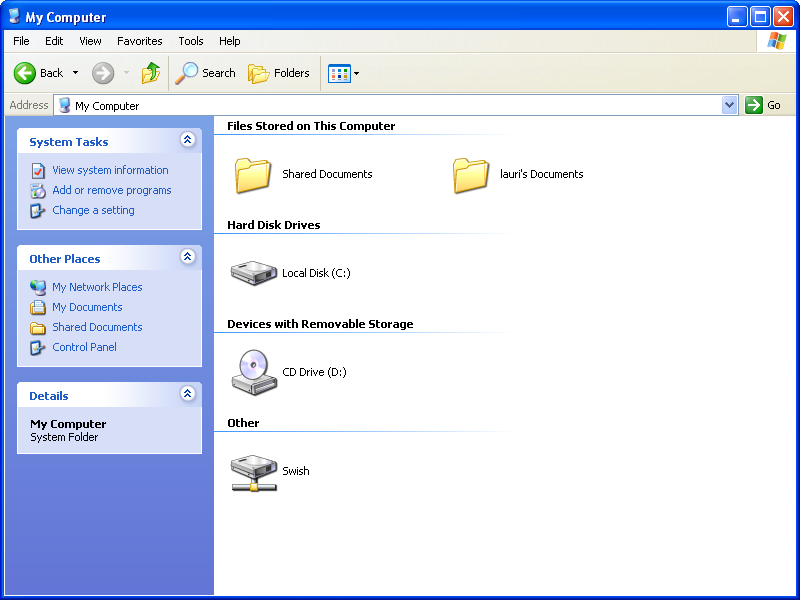
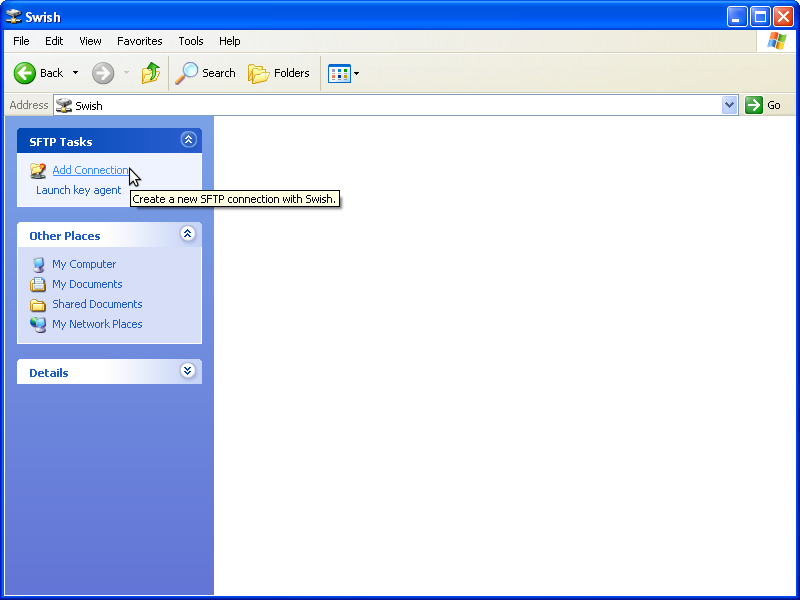
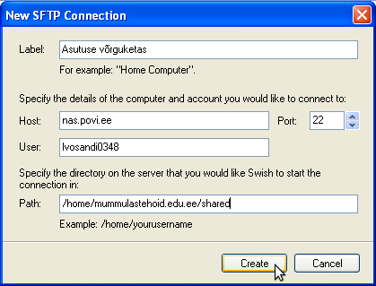
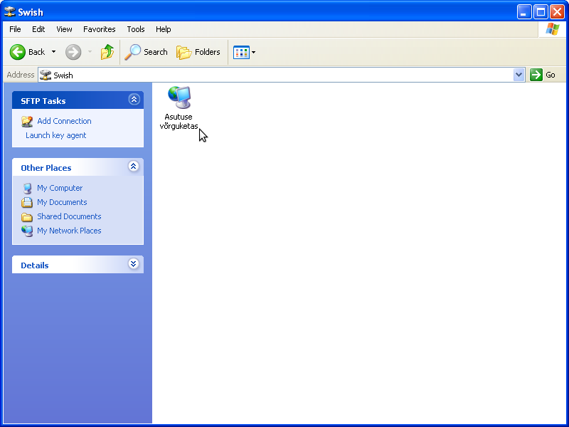
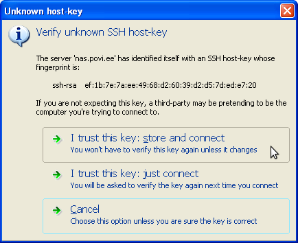
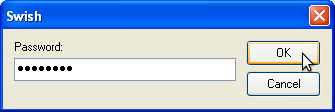

.. date: 2014-09-10
.. tags: SFTP, SSH, Swish, Windows

Windowsis SFTP võrguketta haakimine
===================================

Käesolev juhend on neile kes soovivad oma Windowsiga varustatud arvutist
ligi pääseda SFTP protokollil (SSH File Transfer Protocol) töötavale võrgukettale.

Esiteks laadi alla Swish [#swish]_ ning paigalda see oma arvutisse.
Seejärel ava My Computer ning ava sealt Swish nimeline kataloog:

  
Kataloogi vaates peaks leidma "Add Connection" nupu:

Haakepunkti lisamiseks tuleb talle:

* Nimi anda a'la Asutuse võrguketas või Isiklik võrguketas
* Masinanimi (Host) on Tallinna koolide piloodis osalenud masinate jaoks nas.povi.ee
* Kasutajanimi (User) on sama millega koolides sisse logida saab
* Tee kataloogini (Path) on asutuse võrguketta jaoks kujul /home/asutuse-domeeninimi>/shared
* Tee kataloogini (Path) on isikliku võrguketta puhul /home/asutuse-domeeninimi/ep/eperenimi0123

See info tuleb vastavatesse lahtritesse sisestada:

Peale seda peaks ilmuma Swish kataloogi alla võrguketta nimega haakepunkt:

Sellel topeltklõpsu tehes küsitakse esmakordsel ühendumisel et kas soovid usaldada
serveri pakutud sertifikaati. Igaks juhuks võiks vaadata üle et numbrijada oleks sama mis pildil ning
seejärel vajutada "I trust this key: store and connect" nuppu:

Peale seda küsitakse kasutaja parooli:

Peale seda peaks avanema kataloog koos failide nimistuga.

.. [#swish] http://sourceforge.net/projects/swish/files/swish/swish-0.8.2/swish-0.8.2.exe

