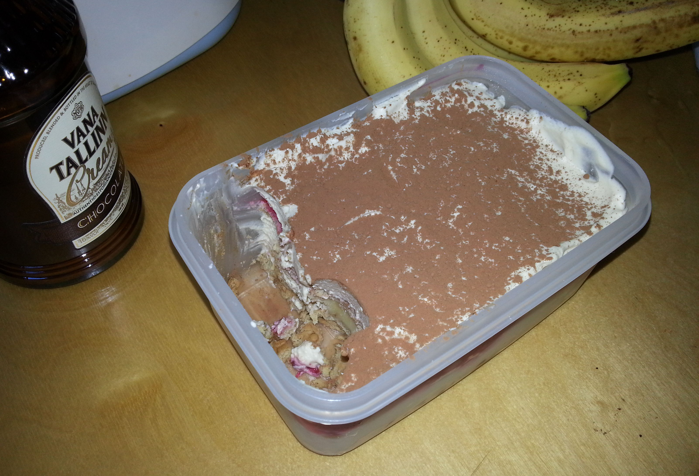

.. title: Talupoja tiramisu
.. author: Lauri Võsandi <lauri.vosandi@gmail.com>
.. tags: 
.. date: 2013-07-15

Talupoja tiramisu
=================

Pikalt on juba mõttes mõlkunud, et peaks üles panema mõned retseptid.

Käesolevas blogipostituses räägiks *tiramisu*-st. Tegu on Itaaliast pärit
maiusega, mis koosneb peaasjalikult kohvis niisutatud biskviitküpsistest ning
*mascarpone* juustust.

Retseptist leidub mitmeid variatsioone ja siinkohal tulekski välja 
ühe eestipärase *tiramisu*-ga.

Koostisosad:

* `Vana Tallinn Cream <http://liviko.ee/tooted/omatooted/likoor/vana-tallinn-cream-2-2/>`_
* `Kalevi klassikaline <http://www.kalev.eu/tooted/maiustused-ja-kupsised/kupsised/vormikupsised/kalev-klassikaline-kupsis-165g>`_ või
  `vanilje küpsis <http://www.kalev.eu/tooted/maiustused-ja-kupsised/kupsised/vormikupsised/kalev-vanillimaitseline-kupsis-165g>`_
* `Vilma kakaopulber <http://www.kalev.eu/tooted/vilma-kupsetustooted/magusad-kupsetustooted/muud/vilma-vahendatud-rasvasisaldusega-kakaopulber-150g>`_
* *mascarpone* juust
* Vahukoor 400ml
* Vaarika, mustika või maasika toormoos
* Rafineerimata *demerara* suhkur
* Üks üpris küpse banaan
* Kohv, mida heledam röst seda parem

Sammud:

* Vahusta koos *mascarpone* juust, vahukoor, maitse järgi paar teelusikatäit
  rafineerimata suhkrut ning šott või kaks Vana Tallinnat
* Aseta anuma põhja üks kiht küpsiseid, küpsise tükkide vahele purusta 
  veel küpsiseid nii et pool küpsisepakki jääks alles
* Tee tassitäis kohvi, kas presskannuga või espressomasinaga, mida kangem
  seda parem
* Kalla anumasse asetatud küpsiste peale pisut kohvi, nii et nad nähtavalt 
  märjaks saaks kuid mitte täiesti pehmeks
* Viiluta banaan, nii et see kataks küpsiste põhja
* Kalla peale pool vahustatud *mascarpone* juustu ning vahukoore segust
* Niisuta alustassil ülejäänud küpsised ning aseta need anumasse,
  ole ettevaatlik kuuma kohviga, kuum kohv lõhub vahu tekstuuri
* Kalla peale toormoos
* Lisa ülejäänud *mascarpone* juustu ja vahukoore segu

Serveerimine:

* Lase külmikus seista mõned tunnid, mida kauem seda parem
* Sõelu kakaopulbrit peale. Veel parem variant on hoida tühjaks
  saanud soolapurgis kakaopulbrit, nii on seda veelgi mugavam peale raputada

Aseained:

* Vana Tallinn Cream asemel sobib ka Baileys Irish Cream, Kahlua kohviliköör, 
  Canari tiramisu liköör, Canari kohviliköör või põhimõtteliselt suvaline
  kohviliköör
* *mascarpone* asemel sobib ka mõni maitsestamata toorjuust, kuid toorjuustude
  juures võib häirivaks osutuda nende hapusus
* Vahukoore asemel sobivad ka munavalged, seda muidugi siis kui salmonella 
  epideemia puhkenud pole

Täiendavad nipid:

* Nagu alati, ära järgi retsepti ja eksperimenteeri ise!
